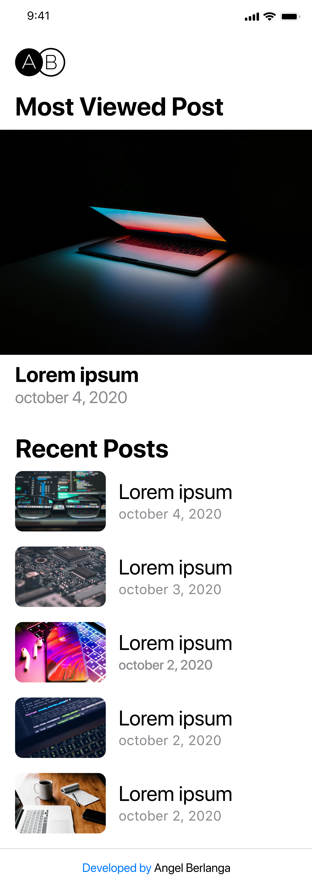

# Hello!
This is my project for CodeWithFriends Fall 2020

## What's my project about?
Well, this is my blog, I coded the backend using JavaScript, specifically Node.js, and the frontend using React.js
It's just a kind of landing page right now, but then I'm gonna add more functionalities
You can see my blog [live](https://eddyber16.github.io/blog)
Also I designed all its UI using Figma
And I used babel for the project's build

## What did I learn?
Firstly, I learned how to implement lowDB (A database in a json file)
Then how to use GitHub workflows, and a bit of Unit Testing in Node.js with mocha and chai, and how to use a kind of CI/CD with GitHub Workflows and Heroku

## What I'm gonna add to the project?
### Backend
- [ ] Upload post photos
- [ ] Authentication and admin page
- [ ] Add views counter to db fields
- [ ] Readjust `created_at` field format, ex. "october 27, 2020"

### Frontend
- [ ] Add post page
- [ ] Loading animation
- [ ] Try to learn Redux and implement it
- [ ] Add some personalized components, like headers
- [ ] Set a responsive layout padding (left and right)
- [ ] Sort posts by creation date